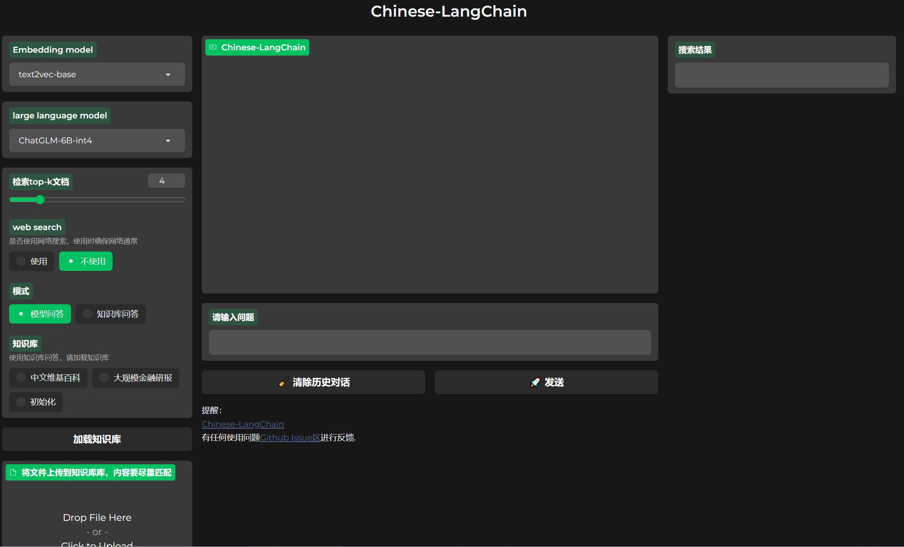

# ChatGLM-6B+Langchain

1. 基于 ChatGLM-6B+Langchain 实现本地化知识库检索与搜索引擎接入

2. 对比 Dify 知识库云服务

# 目录

- [ChatGLM-6B+LangChain](#ChatGLM-6B+LangChain)
  - [知识库向量索引](#知识库向量索引)
  - [运行配置](#运行配置)
  - [搭建流程](#搭建流程)
  - [使用过程](#使用过程)
  - [业务联系](#业务联系)
- [Dify](#Dify)
  - [搭建过程](#搭建过程)
  - [使用](#使用)
- [Comparison](#Comparison)
- [References](#References)

## ChatGLM-6B+Langchain

### 知识库向量索引

- 中文维基百科截止4月份数据，45万
- 截止去年九月的130w条中文维基百科处理结果和对应faiss向量文件
- 金融研报知识图谱
- 以上共 23GB 资料
- [下载链接](https://pan.baidu.com/s/1lcI1JHArTWlOpcSiDH1O3A) 提取码: u6ep

### 运行配置

- 显存 ≥ 12GB ， 运行内存 ≥ 32GB
- 深度学习工作站：GPU: RTX 4090, CPU: Intel(R) Xeon(R) CPU E5-2660 v2

### 搭建流程

1. 创建并激活虚拟环境 `python3 -m venv env`

2. 克隆GitHub repository `git clone https://github.com/catundchat/Chinese-LangChain.git`

3. 安装所需库 `pip install -r requirements.txt`

4. 按需修改 `main.py` 文件中的文件路径，代码块，应用选择后运行即可。已上传一份修改好的 `main.py` 供参考。其中的模型选择部分如下：

```
llm_model_name = 'THUDM/chatglm-6b-int4-qe'  # huggingface repository
    # llm_model_name = 'THUDM/chatglm-6b' # or local file path
    embedding_model_name = 'GanymedeNil/text2vec-large-chinese'  # huggingface: text to vector
    embedding_model_name = 'shibing624/text2vec-base-chinese' # huggingface: text to vector
    vector_store_path = './cache'
    docs_path = './docs'
    kg_vector_stores = {
        '中文维基百科': './cache/zh_wikipedia',
        '大规模金融研报': './cache/financial_research_reports',
        '心理学与生活': './cache/psychology_and_life',
        '初始化': './cache',
    }  
    # change it to your own knowledge database, if doesn't need it, set it "None"
    # kg_vector_stores=None
    patterns = ['模型问答', '知识库问答']  #
    n_gpus=1
```

### 使用过程

- 接入搜索引擎
- 导入数据库
- Embedding 选择 text2vec-base 模型
- llm 选择 ChatGLM-6B-INT4 
- 有模型问答和知识库问答两种方式

使用界面如下：



录制的使用chatglm6b完成多轮对话视频见`chatglm6b_demo.mp4`

### 业务联系

AI爱家可以借鉴其中的知识库问答部分，一部分是知识库问答，一部分是模型问答。较模型问答而言，知识库问答不容易出现常识错误

## ~~Dify~~

Dify 部分详见[此链接](https://github.com/catundchat/Dify_chatbot)

### 搭建过程

1. 构建数据集：只支持单个文件上传，不能整个文件夹上传，单个文件大小小于15MB，支持文件类型`TXT, HTML, Markdown, PDF`

2. 文本分段与清洗：设置分段与预处理规则
   
3. 文档索引：

    a. 嵌入：调用 OpenAI embedding 接口，在用户查询时准确度更高(0.002$/1000 tokens)
   
    b. 其他索引方法：离线向量引擎索引，关键词索引，倒排索引，位图索引等(0 token)
    
    c. 文档索引结束后，数据集即可集成至应用内作为上下文
    
4. 提示词编排：设置prompt

5. 模型选择：支持 OpenAI, Azure OpenAI API KEY

| 模型 | 能否使用 |
|:---|:---:|
| gpt-3.5-turbo | ✔️ |
| gpt-4 | ✔️ |
|gpt-3|✔️|

### 使用

1. Web 端对话机器人：链接在飞书云文档 `Engineering Wiki-算法-Dify chatbot`

2. API : 支持调用对话型应用 API  [官网](https://dify.ai) 

## Comparison

| 特性 | CHATGLM-6B+Langchain | Dify |
|:---|:---:|:---:|
| 可使用数据库 | ✔️ | ✔️ |
| 支持的数据类型 | md、pdf、docx、txt | txt,html,markdown,pdf |
|最大文件|理论上是显存大小|15MB|
|数据上传|多个文件|单个文件|
|   可使用 GPT-4  |  ❌  |  ✔️   |
|API调用|❌|✔️|

## References

1. [基于本地知识库的 ChatGLM 等大语言模型应用实现](https://github.com/imClumsyPanda/langchain-ChatGLM)
2. [基于本地知识库的自动问答](https://github.com/thomas-yanxin/LangChain-ChatGLM-Webui)
3. [定制基于 ChatGLM-6B 的本地知识库+联网检索能力的 LangChain Agent](https://zhuanlan.zhihu.com/p/635724707)


